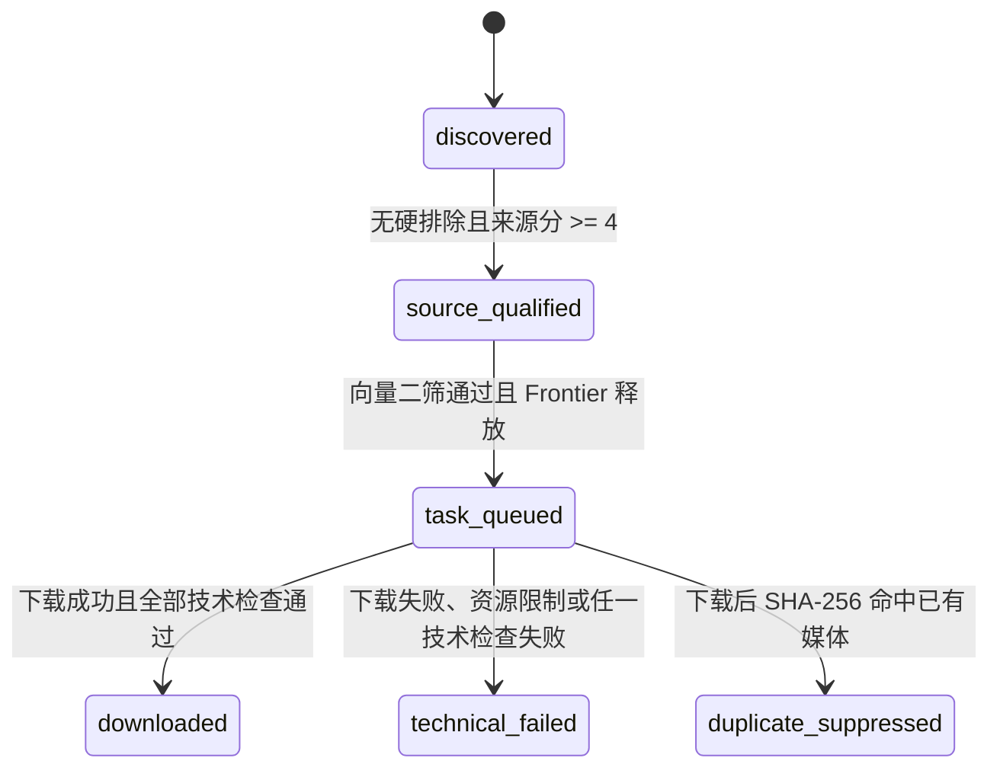

# 监控候选池 v2 契约设计

状态：`G3.2 SQLite + Qdrant 架构已由用户确认（2026-08-25）`

本文只定义 v2 的边界和数据契约，不是可执行实现。当前步骤不得创建 SQLite 数据库、运行迁移、生成查询包、访问平台或下载视频。

## 1. 不可破坏的系统不变量

1. 先证明候选来源像监控，再判断是否与任务有关。任务高分不能覆盖来源不合格或硬排除。
2. 旧 `youtube-video-agent/`、`.ytb-download/`、`YTB_Download/` 永久只读；v2 运行时不得导入或调用旧执行器。
3. 候选全局主键固定为 `platform:source_id`，平台值仅为 `youtube`、`dailymotion`、`peertube`。
4. 下载流水线只使用公开元数据进行来源门和任务评分。视觉门、VLM、抽帧语义审核、字幕、ASR、人工预览均不进入流水线。
5. 下载后只做技术验证，不产生语义接受结论；系统任何位置都不得写入 v2 状态 `accepted`。
6. 来源合格阈值固定为 `source_score >= 4`。样本不足时停止并报告，不能降低该阈值。
7. SQLite 是候选状态、评分证据和审计事件的唯一事实源；Manifest 是从 SQLite 确定性导出的交付视图。
8. v1 网络配置固定为 `default`：继承启动进程的既有网络环境，但应用不得主动设置、清空或切换代理；VPN/代理对照实验不进入本版本。
9. 所有时间使用 UTC ISO 8601，文件哈希使用 SHA-256，所有落盘元数据必须先脱敏。
10. `Candidate DB != Qualified Frontier != Secondary Batch`：候选库可以很大，只有通过硬门和分数门的候选才能竞争 Frontier，昂贵的二次筛选每次只消费一个小批次。
11. 撒网、资格筛选、二次筛选和下载是四个可独立恢复的阶段。下载器只能消费二次筛选明确标记为 `download_eligible` 的候选。
12. 不设置固定 secondary pool 总量。Batch Generator 按优先级增量释放候选，达到 Campaign 目标或停止条件后立即停止。
13. SQLite 是唯一控制面和事实源；Qdrant 是可从 SQLite 重建的持久化语义索引，不能独立写候选状态、租约、配额或 Manifest。
14. v1 的二次语义筛选由版本化向量检索和确定性策略完成，不把候选批次交给大模型上下文审核。
15. 向量相似度只能提出近重复关系，不能单独永久删除候选；精确身份、审计和最终去重结论仍由 SQLite 管理。

## 2. 目录契约

规划中的目录如下；除本文外，均在相应实施步骤获批后才创建：

```text
surveillance-video-agent/
├── docs/
│   └── v2-contract.md
├── query-packs/
│   ├── demand_action_v1/
│   └── fight_confounder_v1/
├── src/surveillance_video_agent/
│   ├── contracts.py
│   ├── db.py
│   ├── adapters/
│   │   ├── base.py
│   │   ├── youtube.py
│   │   ├── dailymotion.py
│   │   └── peertube.py
│   ├── scoring/
│   │   ├── source.py
│   │   └── task.py
│   ├── discovery.py
│   ├── frontier.py
│   ├── batch_generator.py
│   ├── vector_index.py
│   ├── embedding.py
│   ├── dedupe.py
│   ├── secondary_filter.py
│   ├── progress.py
│   ├── scheduler.py
│   ├── downloader.py
│   ├── technical.py
│   ├── manifest.py
│   └── legacy_import.py
└── tests/
    ├── unit/
    ├── integration/
    └── smoke/

.surveillance-pool/
├── state/candidates.sqlite3
├── vector/qdrant/
├── runs/<run_id>/
│   └── secondary-batches/<batch_id>.jsonl
├── tmp/downloads/<run_id>/
└── quarantine/technical_failed/<run_id>/

Candidate_Downloads/
├── demand_action_v1/
│   ├── <deterministic-candidate-name>.<ext>
│   └── manifest.jsonl
└── fight_confounder_v1/
    ├── <deterministic-candidate-name>.<ext>
    └── manifest.jsonl
```

规则：

- 最终文件名由 `candidate_key` 确定性派生，必须经过跨平台安全化并带短哈希，不能仅依赖可变标题。
- 技术失败的媒体不得进入 `Candidate_Downloads/`。失败文件若存在，只能保留在隐藏 quarantine 中并记录路径；清理必须是独立、显式操作。
- 查询包一旦标记 `frozen`，原文件不可原地改写；任何改动必须产生新版本。

## 3. 平台适配器契约

三个适配器必须实现同一组同步、无状态接口；并发、重试、缓存和数据库写入统一由上层调度器控制。适配器不得自行修改 SQLite。

### 3.1 `search`

```text
search(SearchRequest) -> list[SearchHit]
```

`SearchRequest` 必含：

- `platform`
- `query`
- `lang`：查询语言，只允许 `en`、`es`、`fr`
- `query_pack_version`
- `network_config`：v1 固定 `default`
- `limit`：固定上限 20
- `request_id`、`run_id`

`SearchHit` 必含：

- `platform`、`source_id`、`candidate_key`
- `source_url`
- 平台返回的轻量标题、上传者、时长等可用字段
- `position`、`query`、`lang`、`query_pack_version`
- 经脱敏的原始响应摘要

### 3.2 `probe`

```text
probe(ProbeRequest) -> ProbeResult
```

`ProbeResult` 必须尽可能归一化：标题、视频简介 `video_description`、标签、上传者、上传者 ID、频道、播放列表、时长、上传时间、可用性、文件大小估计、宽高、规范 URL及经脱敏的原始元数据。缺失值保留为 `null`，不得编造。视频简介必须保留平台原文；展示或导出时不得用 AI 摘要覆盖原文。

### 3.3 `download`

```text
download(DownloadRequest) -> DownloadResult
```

`DownloadRequest` 固定包含：候选键、规范 URL、受管临时目录、最高 1080p、单文件 2GB 上限、超时和 `network_config=default`。

约束：

- 使用当前 yt-dlp 默认客户端，不设置 `youtube:player_client=android`。
- 一次调用只允许处理一个候选；禁止播放列表展开。
- 下载器只返回执行结果、文件路径、字节数和错误分类，不做评分、状态迁移或发布。
- 错误分类至少区分：`network`、`rate_limited`、`not_found`、`private`、`unsupported`、`resource_limit`、`tool_error`、`timeout`。

## 4. 查询包契约

实际中文概念词和 en/es/fr 查询将在下一阶段由用户冻结，本节只固定结构。

每个查询包必须包含：

- 全局唯一的 `query_pack_version`
- `campaign_id`
- 用户冻结的中文需求定义和各 subtype 概念
- AI 派生的 en/es/fr 查询
- 每条查询显式分离的 `source_anchor` 与 `action_or_scene_term`
- 创建时间、冻结时间、冻结人、内容 SHA-256
- `network_config=default`

验证规则：

- 每条可执行查询必须同时有非空来源锚点和动作/场景词。
- 可执行查询语言只允许 en/es/fr；中文是冻结的语义源，不直接混入派生查询。
- 查询包版本不得被缓存层忽略，也不能跨 campaign 静默复用。
- 样本不足只能返回查询包阶段修订并产生新版本。

`lang` 在候选和 Manifest 中始终表示“发现该候选的查询语言”，不推断视频口语。

## 5. 来源门和任务评分契约

### 5.1 硬排除

在计算来源分前检查公开元数据。命中以下任一类别，候选保持 `discovered`，记录 `hard_excluded=true` 和证据，不允许进入来源合格状态：

- 移动摄影
- 影视
- 游戏
- 动画
- 教程
- 设备广告

硬排除不能被任何正分抵消。旧拒绝理由和旧频道名单不能成为硬排除证据。

### 5.2 来源评分

每个规则类别对同一候选最多计分一次，防止关键词堆叠：

| 规则代码 | 分值 | 证据范围 |
|---|---:|---|
| `source.title_strong_anchor` | +4 | 标题中的 CCTV、security camera、surveillance camera、监控录像等强锚点 |
| `source.metadata_evidence` | +2 | 描述、标签、频道或播放列表中的来源证据 |
| `source.rawness` | +1 | raw、uncut、timestamp 等原始性线索 |
| `source.legacy_uploader_prior` | 0..+2 | 有迁移 provenance 的旧已完成上传者正先验 |
| `source.packaging_penalty` | -3 | 新闻包装、解说或合集 |

只有 `hard_excluded=false` 且总分 `>=4` 才能进入 `source_qualified`。

所有通过来源门的候选统一标记为 `camera_pool=surveillance`。CCTV、security camera、surveillance camera、监控录像、doorbell camera、Ring camera 等都作为同一类可用监控来源，不再拆分核心池和门铃邻近池，也不设置分池配额或独立统计。

具体命中的来源锚点仍写入评分证据和 Manifest 理由，便于审计，但只作为证据，不形成新的候选分类。

### 5.3 任务评分

每个候选对每个 campaign/subtype 独立计算：

| 规则代码 | 分值 | 证据范围 |
|---|---:|---|
| `task.title_action` | +4 | 标题动作/场景命中 |
| `task.metadata_action` | +2 | 描述或标签动作/场景命中 |

任务分 `>=4` 只代表候选有资格进入 Qualified Frontier，并不直接进入下载队列。同一候选即使多个 subtype 合格，也只能被一个活动 Secondary Batch 租约占用；只有二次筛选通过后才建立唯一下载队列归属。归属决策及其他任务分全部保留审计记录。

## 6. 状态机契约



状态规则：

- 合法值只有：`discovered`、`source_qualified`、`task_queued`、`downloaded`、`technical_failed`、`duplicate_suppressed`。
- `accepted`、`rejected`、`published` 均不是候选状态。
- 来源不合格或硬排除不新增拒绝状态，候选保持 `discovered` 并保存理由。
- 来源合格但任务不合格时保持 `source_qualified`。
- Frontier、Secondary Batch 和二次筛选决定使用独立表记录，不扩充候选状态枚举。候选处于 Frontier 或等待二次筛选时仍是 `source_qualified`。
- 二次筛选决定 `metadata_rejected`、`deferred`、`reclassified`、`download_eligible` 不是候选状态，也不得写成 `accepted`。
- 下载器内部重试不产生状态回退；重试耗尽后才进入 `technical_failed`。
- `technical_failed` 与 `downloaded` 都进入全局去重集合。后续搜索再次发现同一 `candidate_key` 时，只补充发现 provenance 和 `last_seen_at`，不得创建新候选、重新排队或再次下载。
- `duplicate_suppressed` 是下载后确认的精确重复终态，不进入输出目录、不计入 Campaign 数量，也不能由普通发现流程重新排队。
- v1 不定义从 `technical_failed` 自动重排队。若未来需要重试，必须新增契约版本、显式人工操作和审计事件，不能通过普通发现流程绕过去重。
- 每次状态变化必须在同一 SQLite 事务中写入 `state_transitions`，记录旧状态、新状态、原因、run ID和时间。

## 7. SQLite 逻辑模型

数据库固定路径：`.surveillance-pool/state/candidates.sqlite3`。

连接必须启用：

```text
PRAGMA foreign_keys = ON
PRAGMA journal_mode = WAL
PRAGMA busy_timeout = 5000
```

### 7.1 核心表

| 表 | 主键/唯一约束 | 用途 |
|---|---|---|
| `schema_meta` | `schema_version` | 记录迁移版本和创建时间 |
| `runs` | `run_id` | 保存执行类型、配置、代码版本、开始/结束时间和结果 |
| `campaigns` | `campaign_id` | 保存 campaign 身份和当前容量策略版本指针 |
| `campaign_policy_versions` | `(campaign_id, policy_version)` | 保存不可变的 subtype 数量上限和 campaign 总数上限 |
| `frontier_policy_versions` | `(campaign_id, frontier_policy_version)` | 保存 batch、probe 和低有效率停止策略 |
| `embedding_schema_versions` | `embedding_schema_version` | 保存 provider、model、维度、距离函数、文本模板和规范化规则 |
| `semantic_query_templates` | `template_version` | 保存不可变 subtype 查询文本模板和内容哈希 |
| `vector_index_outbox` | `event_id` | 在 SQLite 事务内记录带投影修订号的待 upsert/rebuild 向量事件 |
| `candidate_embeddings` | `(candidate_key, embedding_schema_version, vector_name)` | 保存当前投影修订号、当前输入哈希、已索引输入哈希、Qdrant point ID和索引就绪状态，不重复保存向量正文 |
| `query_packs` | `query_pack_version` | 保存冻结中文定义、内容哈希和冻结状态 |
| `queries` | `query_id`；包内查询唯一 | 保存 lang、来源锚点、动作/场景词和最终查询文本 |
| `search_cache` | `(platform, query, lang, query_pack_version, network_config)` | 保存搜索响应、获取时间、过期时间和脱敏载荷 |
| `probe_cache` | `(platform, source_id, network_config)` | 保存归一化 probe 元数据、脱敏原始载荷和过期时间 |
| `adapter_calls` | `request_id` | 不可变记录适配器操作、缓存命中、耗时、错误分类与次数 |
| `embedding_calls` | `call_id` | 不可变记录 provider/model、输入哈希、数量、耗时与错误，不复制文本或向量 |
| `candidates` | `candidate_key`；`(platform, source_id)` 唯一 | 候选规范元数据、来源状态、来源总分和 camera pool |
| `candidate_discoveries` | `discovery_id`；候选+查询+位置唯一 | 保存候选被哪些查询、语言和版本发现 |
| `subtype_semantic_queries` | `query_key`；campaign/subtype/pack/template/schema 唯一 | 保存版本化查询文本、输入哈希、Qdrant point和索引状态，不保存向量正文 |
| `threshold_calibrations` | `calibration_id` | 保存 uploader 分组校准报告及 subtype 阈值；样本不足时阈值对象必须为空 |
| `calibration_exports` | `export_id` | 保存待外部人工填写的 metadata-only JSONL 路径、哈希和 subtype 数量 |
| `probe_selections` | `(campaign_id, query_pack_version, candidate_key)` | 持久化累计 probe 预算、稳定选择排名及完成状态，重跑不得扩池 |
| `secondary_batch_yields` | `batch_id` | 保存真实二筛释放数、合格数、yield和低有效率标记 |
| `campaign_run_control` | `(run_id, campaign_id)` | 保存连续低有效率批次和停止原因 |
| `score_evidence` | `evidence_id` | 保存 source/task 每个规则的分值、理由和字段证据 |
| `candidate_task_scores` | `(candidate_key, campaign_id, subtype)` | 保存独立任务分和计算版本 |
| `frontier_entries` | `(candidate_key, campaign_id, subtype)` | 保存合格候选的排序证据、分区和 Frontier 生命周期 |
| `secondary_batches` | `batch_id` | 保存每次 Top-K 生成参数、策略版本和完成统计 |
| `secondary_batch_items` | `(batch_id, candidate_key)` | 保存批内排名、租约、来源分区和唯一候选占用 |
| `secondary_filter_decisions` | `(batch_id, candidate_key)` | 保存向量二筛分数、阈值、决定和 reclassify 结果 |
| `dedupe_policy_versions` | `dedupe_policy_version` | 保存近重复阈值、时长容差、邻居数和簇策略 |
| `duplicate_edges` | `edge_id`；有序候选对+kind+evidence version 唯一 | 并存保存 exact/fingerprint/vector/SHA-256 各层重复证据，后写证据不得覆盖前一层 |
| `duplicate_clusters` | `duplicate_cluster_id` | 保存重复簇类型、策略版本和生命周期；不预存依赖 subtype 语义分的固定代表 |
| `duplicate_cluster_members` | `(duplicate_cluster_id, candidate_key)` | 保存簇成员和当前 run 的 leased/suspended 状态 |
| `frontier_partition_stats` | `(campaign_id, subtype, query_id)` | 保存释放量、通过量、滑动窗口有效率和暂停状态 |
| `queue_assignments` | `candidate_key` 唯一 | 只保存二次筛选通过后的唯一下载归属和排队时间 |
| `download_attempts` | `attempt_id` | 保存适配器、时间、错误分类、临时/最终路径和字节数 |
| `technical_checks` | `attempt_id` 唯一 | 保存 ffprobe、视频流和首/中/尾解码结果 |
| `media_objects` | `sha256` | 全局唯一媒体哈希声明、规范候选、发布状态和最终路径 |
| `media_publish_intents` | `attempt_id` 唯一 | 保存临时路径、最终路径、哈希和可恢复的发布阶段 |
| `state_transitions` | `transition_id` | 追加式状态审计日志 |
| `legacy_downloads` | `candidate_key` | 迁移 YouTube ID、原状态和 provenance，不写 v2 `accepted` |
| `legacy_imports` | `import_id` | 不可变记录旧历史哈希、导入数量、先验数量和缺失 metadata 数 |
| `uploader_priors` | `platform, uploader_id` | 保存完成样本数、可追溯 ID和最终 0..2 正先验 |

### 7.2 `candidates` 必备字段

- `candidate_key`、`platform`、`source_id`、`source_url`
- `title`、`video_description`、`tags_json`
- `uploader`、`uploader_id`、`channel`、`playlist`
- `duration_seconds`、`estimated_bytes`、`width`、`height`
- `hard_excluded`、`hard_exclusion_reasons_json`
- `camera_pool`、`source_score`
- `status`
- `first_seen_at`、`last_seen_at`、`created_run_id`、`updated_run_id`

数据库约束必须保证：

- `candidate_key = platform || ':' || source_id`。
- `source_qualified` 必须满足无硬排除、来源分 `>=4` 且 camera pool 非空。
- `task_queued` 必须已有任务分 `>=4`、已完成的 Secondary Batch 租约、`download_eligible` 二次筛选决定和唯一队列归属。
- `downloaded`、`technical_failed` 或 `duplicate_suppressed` 必须存在相应下载尝试及技术结果、失败原因或 SHA-256 重复证据。
- `downloaded` 必须引用 `media_objects.publish_status=published` 且最终路径存在；`duplicate_suppressed` 必须引用另一条已发布媒体的相同 SHA-256。
- 查询包冻结后不能原地更新查询内容。
- 审计表只追加，不静默覆盖历史证据。

## 8. Discovery DB、Qdrant、Qualified Frontier 与 Batch Generator

### 8.1 阶段解耦

```text
三平台搜索
  -> SQLite Discovery DB（可大、持久、保存事实）
  -> 身份/规范 URL 去重 + 搜索字段上的便宜硬排除
  -> 按预算选择 probe（每 Campaign/query-pack version 最多 150）
  -> 合并完整公开元数据，再执行硬排除、来源评分、任务评分和规范指纹去重
  -> 写入带修订号的 SQLite outbox -> Qdrant 持久化语义索引
  -> 生成向量近重复证据/簇 -> 刷新 Qualified Frontier
  -> 从 SQLite 取得当前 Frontier 合格快照
  -> Qdrant 在该快照内按 subtype 语义召回 K×oversample
  -> SQLite 重验、语义阈值、RRF、近重复簇抑制和公平调度
  -> 唯一未完成 Secondary Batch（默认最多 20）
  -> 二筛完成后，按剩余容量把 download_eligible 原子加入全局串行下载队列
  -> 下载到临时区 -> 技术检查 -> SHA-256 去重 -> 可恢复发布
  -> `downloaded` 提交后才计数；先消费已审核候补，不足才生成下一批，满足则 STOP
```

各阶段提供独立入口并可安全重启：

```text
discover(query_pack_version) -> DiscoverySummary
qualify(campaign_id, probe_budget) -> QualificationSummary
sync_vector_index(embedding_schema_version) -> VectorSyncSummary
refresh_duplicate_clusters(embedding_schema_version, dedupe_policy_version) -> DedupeSummary
refresh_frontier(campaign_id, frontier_policy_version) -> FrontierSummary
generate_secondary_batch(campaign_id, frontier_policy_version) -> SecondaryBatch
enqueue_downloads(batch_id) -> QueueSummary
recover_and_publish(attempt_id) -> PublishSummary
```

任一入口都只能推进自己负责的事实。`qualify` 只计算资格事实并产生向量 outbox，不能假装向量已经就绪；`sync_vector_index` 不能隐式创建 Frontier 项；`refresh_duplicate_clusters` 必须先于 `refresh_frontier`。Qdrant 不得直接产生候选状态或下载队列写入，Batch Generator 不得下载。

### 8.2 Discovery DB 与有限 probe

1. 三个平台可并行发现，但每个平台共享一个最多 2 个在途请求的限流器；`search` 和 `probe` 都计入该限制。
2. 每条查询最多取搜索结果前 20，所有结果先以 `candidate_key` 幂等写入 SQLite。Candidate DB 数量不等于待二次筛选数量。
3. 先使用搜索命中已有字段做身份/规范 URL 去重和明确的便宜硬排除，再按可用元数据对尚未 probe 的候选排序。依赖视频简介、标签、频道或播放列表的规范指纹、完整硬排除和评分只能在 probe 合并完成后执行。
4. 每个 Campaign 对一个 query-pack version 最多选择 150 个唯一候选做 probe；未被选择的命中保留在 Discovery DB，但不进入 Frontier。
5. `downloaded`、`technical_failed`、`duplicate_suppressed` 以及迁移的旧已下载 ID 都属于下载阻断集合。
6. 搜索缓存必须精确命中五元键：`platform/query/lang/query-pack-version/network-config`，任一字段不同即缓存未命中。

### 8.3 Qdrant 派生索引契约

v1 默认使用本地磁盘持久化 Qdrant，路径为 `.surveillance-pool/vector/qdrant/`。实现必须通过 `VectorIndexPort` 隔离 Qdrant API，以便未来切换独立服务而不改变 SQLite schema 或 Frontier 逻辑。

```text
upsert_candidate(candidate_key, embedding_schema_version, vectors, payload)
query_relevance(subtype, filters, limit, score_threshold)
query_neighbors(candidate_key, vector_name, limit, score_threshold)
index_health(embedding_schema_version)
rebuild_index(embedding_schema_version)
```

规则：

- 每个 `embedding_schema_version` 使用独立 collection；模型、维度、距离函数、文本模板或规范化方式变化必须新建版本，不能原地混用向量。
- Qdrant point ID 由 `candidate_key` 确定性派生 UUIDv5，同一 collection 内重复 upsert 必须幂等。
- 使用两个 named vectors：`relevance` 用于 subtype 召回，`duplicate` 用于近重复发现。
- `relevance` 输入只含标题、视频简介、标签、频道和播放列表；subtype 查询向量来自冻结的中文定义及其版本化多语言派生文本。
- `duplicate` 输入使用规范化标题和视频简介，不加入任务分、来源分或 subtype 名称，避免把“同类事件”误当成“同一内容”。
- Qdrant payload 只保存过滤所需的最小派生字段和 `candidate_key`；原始元数据仍只在 SQLite。
- 只有已经完成 probe、通过来源门、至少一个 campaign/subtype 任务分 `>=4` 且静态资源约束合格的候选需要生成 v1 向量投影；其他 Discovery DB 记录不因未索引而阻塞 Batch Generator。
- SQLite 在候选/元数据事务内追加 `vector_index_outbox`，同步 worker 成功 upsert 后才把 `candidate_embeddings.index_status` 更新为 `ready`。
- 每次会改变向量输入的元数据更新，都必须在同一 SQLite 事务中递增候选投影修订号、把相关 `candidate_embeddings` 置为 `pending`、暂停既有 Frontier 项并追加 outbox；旧向量在新投影 ready 前不得参与召回。
- outbox 事件必须携带 `projection_revision + input_hash`。同一 collection 只允许一个有序写入者；worker 在 upsert 前后都要核对该事件仍是 SQLite 当前修订。被新修订取代的事件只标记 `superseded`，不得覆盖较新的 Qdrant point 或把旧输入误标为 `ready`。
- `ready` 的含义是：Qdrant point 中的修订号和输入哈希与 SQLite 当前规范元数据一致，且 `relevance`、`duplicate` 两个 named vectors 都成功写入。仅“曾经 upsert 成功”不等于当前 ready。
- Qdrant payload 可能滞后，所有召回结果必须回查 SQLite 当前状态、配额、租约和阻断集合。
- 所需 embedding 覆盖不完整、版本不一致或 Qdrant 不可用时，Batch Generator 必须停止并报告，不能静默退化为全量 SQL或大模型上下文筛选。

### 8.4 四层去重契约

1. **身份去重（search 写库时）**：SQLite 对 `candidate_key` 和平台规范 URL实施唯一约束；重复发现只补 provenance。
2. **规范指纹去重（probe 合并后）**：对规范化 URL、标题/简介指纹建立 `duplicate_edges(kind=exact|fingerprint)`。
3. **向量近重复（向量同步完成后、Frontier 激活前）**：只在 SQLite 当前仍满足资格的候选键集合内查询 Qdrant `duplicate` 最近邻，再结合时长容差、规范标题相似度和上传者关系生成 `kind=vector_suspect` 证据，并刷新疑似重复簇。
4. **下载后精确去重（技术检查后、发布前）**：计算 SHA-256；命中已发布媒体时进入 `duplicate_suppressed`，文件留在隐藏 quarantine，不发布、不计数。

向量相似度阈值必须绑定 `embedding_schema_version + dedupe_policy_version` 并用已标注重复对校准，不能跨模型复用固定阈值。仅凭向量相似不能永久删除候选。

疑似重复形成 cluster 后：

- 同一 cluster 同时最多租约一个代表候选。
- `refresh_duplicate_clusters` 只写重复证据和簇；`refresh_frontier` 只按确定性资格创建可竞争项，不预先选择语义代表。
- 代表候选必须在 Qdrant 召回和 RRF 完成后，由 Batch Generator 按当前 subtype 的混合排名选择，并在同一 SQLite 事务中取得 cluster 租约。这样语义排名不会反向成为 Frontier 激活的前置条件。
- 代表候选二筛或技术失败后，可以释放簇内下一个候选。
- 代表候选成功下载后，其余疑似成员在当前 run 保持 `frontier_entries.status=suspended`，不自动删除；新去重策略版本或外部标注证据可审计地解除。向量疑似关系本身不能产生 `duplicate_suppressed` 终态。

### 8.5 Qualified Frontier 入队规则

`refresh_frontier` 是唯一创建或更新 `frontier_entries` 的入口。只有同时满足以下条件的候选，才可得到 `ready` 项：

- 未命中硬排除。
- 来源分 `>=4`。
- 对相应 Campaign/subtype 的任务分 `>=4`。
- 未处于下载阻断集合。
- 时长等已知静态资源约束合格。
- 当前 `embedding_schema_version` 的 `relevance` 与 `duplicate` 向量均与最新输入哈希一致并为 `ready`。
- 当前去重策略版本的近重复簇刷新已完成。簇成员可以同时为 `ready`，但 Batch Generator 只能租约混合排名最高的一个；其他成员保持未租约的 `ready`，只有代表下载成功后才在当前 run 转为 `suspended`。

一个候选不能同时出现在两个未完成 Secondary Batch 中。Batch Generator 必须在 SQLite `BEGIN IMMEDIATE` 事务内获取候选和 duplicate cluster 租约；崩溃后只允许按审计过的租约超时恢复。

`frontier_entries` 生命周期只允许 `ready`、`leased`、`consumed`、`suspended`。向量二筛结论保存在 `secondary_filter_decisions`，不能混入候选状态或 Frontier 生命周期。

同一候选可能由多条查询发现。`refresh_frontier` 必须为每个 `(candidate_key, campaign_id, subtype, run_id)` 确定一条不可变的调度归因：先取当前 query pack 中搜索位置最小者，再按首次发现时间、`query_id` 排序。公平轮转的 `lang`、低有效率统计的 `query_id` 和 Manifest 主查询都使用该归因；其余发现来源仍完整保存在 `candidate_discoveries`，不得丢弃或重复计数。

### 8.6 语义排序和公平调度

每个 subtype 先由 SQLite 固定一份 `ready` Frontier 候选键快照，再由 Qdrant 仅在对应 point ID 集合内召回 `K × vector_oversample_factor` 个候选。不得只依赖可能滞后的 Qdrant payload 来表达 Frontier 资格。为避免直接相加不同量纲的分数，使用版本化 Reciprocal Rank Fusion 合并两组排名：

```text
deterministic_rank = task_score DESC, source_score DESC, candidate_key ASC
vector_rank = relevance similarity DESC, candidate_key ASC
hybrid_rank = RRF(deterministic_rank, vector_rank, rrf_k)
```

语义阈值先于 RRF：低于当前模型阈值的候选不得因确定性排名高而被 RRF 重新带回。`deterministic_rank` 和 `vector_rank` 都只在“本次 Qdrant 召回、通过语义阈值、且 SQLite 回查仍合格”的同一候选集合上计算。这样 RRF 只负责排序，不负责绕过语义门。

多样性不进入 RRF 分值，统一由全局调度器处理：

1. 只轮转仍有 `target - downloaded - task_queued > 0` 缺额的 subtype；`task_queued` 是容量预留，入队事务不得使该表达式小于 0。
2. 每轮从一个 subtype 取一个候选，避免易搜 subtype 占满整批。
3. subtype 内轮转 `(platform, lang)` 桶，不设硬配额。
4. 每上传者最多 5 条，按两个 v1 Campaign 合计；开放租约、`task_queued` 和 `downloaded` 都暂占额度，未通过后释放。
5. 同一疑似重复 cluster 每批最多一个代表。
6. 某桶或 subtype 耗尽时跳过，不能降低来源门槛或语义阈值补足。

### 8.7 Secondary Batch Generator 与向量二筛

- 默认 `secondary_batch_size=20`、`vector_oversample_factor=5`，均由版本化 Frontier Policy 提供。
- Qdrant 召回只是临时 oversample，不形成固定 100/125 条 secondary pool。
- 同一 `(run_id, campaign_id)` 同时最多有一个未完成 Secondary Batch。前一批必须完成全部决定、释放租约并处理已审核候补后，才允许生成下一批，避免通过并发补批重新制造无限活跃池。
- 每个召回项必须回查 SQLite，并产生 `download_eligible`、`below_semantic_threshold`、`duplicate_suspect`、`reclassified` 或 `deferred` 决定；回查失效项不能占用 K，Generator 应从同一 Frontier 快照继续取下一项，直到达到 K 或快照耗尽。
- `reclassified` 只有在另一个尚有缺额的 subtype 相似度达标且任务分 `>=4` 时允许。
- 一个批次生成后保持不可变；补批创建新 `batch_id`。
- 批次写入 SQLite，并确定性导出到 `.surveillance-pool/runs/<run_id>/secondary-batches/<batch_id>.jsonl`。
- 二筛只使用公开文本元数据 embedding；禁止视频下载、人工预览、字幕、ASR、抽帧、VLM和大模型上下文审核。
- Campaign 计数只认最终 `downloaded`，不把 `download_eligible` 当成有效样本。
- `enqueue_downloads` 必须在 SQLite 事务中先消费已经完成二筛但尚未排队的 `download_eligible` 候补，重新检查状态、上传者上限、重复簇和 `target - downloaded - task_queued`，只为剩余容量创建 `queue_assignments` 并迁移为 `task_queued`。超出当时剩余容量的合格项保留为可审计候补，不自动扩大队列。

### 8.8 增量消费与提前停止

默认 Frontier Policy：

```text
probe_budget_per_campaign = 150
secondary_batch_size = 20
vector_oversample_factor = 5
low_yield_threshold = 0.10
low_yield_consecutive_windows = 3
low_yield_partition_window_size = 20
```

语义阈值、RRF 参数和近重复阈值不设跨模型默认值，必须由 `embedding_schema_version` 绑定的测试/pilot 策略提供。

`secondary_yield = download_eligible 数 / 完成向量二筛数`。

增量循环固定为：完成一批二筛 -> 从该批及既有已审核候补补满剩余下载槽位 -> 全局串行下载队列排空并提交技术终态 -> 重新计算 `downloaded` 数 -> 若仍有缺口，先再次消费已审核候补；确无候补时才生成下一批。不得在尚有当前 Campaign 的 `task_queued` 或未恢复发布意图时预生成新批。

停止规则：

1. 所有 subtype 的 `downloaded` 数达到当前 Campaign Policy 目标：停止生成批次、停止下载并结束 Campaign。
2. Frontier 耗尽且 probe budget 已用完：停止并报告缺口，返回中文概念/查询包阶段。
3. 某个 `(query_id, subtype)` 分区连续 3 个、每个含 20 个已二筛项的窗口有效率都 `<10%`：暂停该分区。
4. 整个 Campaign 连续 3 个 Secondary Batch 有效率都 `<10%`：停止 Campaign并返回查询包修订。
5. Qdrant 不健康、向量版本不一致或 eligible 候选 embedding 覆盖不完整：停止并报告索引证据。
6. 30GB Campaign 技术预算耗尽但 subtype 目标仍未满足：停止并报告，不继续生成批次。
7. 任一停止分支都不得降低来源阈值 4、语义阈值或去重门，也不得把失败决定自动送去下载。

## 9. 下载和技术验证契约

### 9.1 下载限制

- 时长：10 秒至 15 分钟，边界包含在内。
- 最高分辨率：1080p。
- 单文件最大：2GB。
- 每个 campaign 最大：30GB，以最终媒体实际字节数计。
- 全局只有一个下载 worker。
- campaign/任务切换之间随机冷却 10–20 秒，实际冷却值写入审计日志。
- yt-dlp 提取请求之间至少冷却 1 秒，HTTP、fragment 和 extractor 重试使用有上限的指数退避；fragment 并发固定为 1。
- worker 对 `network`、`rate_limited`、`timeout` 最多执行 2 次额外重试，默认退避 20 秒、40 秒并增加至多 5 秒抖动。每次写入不可变 `download_retry_events`；其他错误不得重试。
- YouTube/Dailymotion 使用项目虚拟环境锁定的 yt-dlp 与浏览器指纹依赖，不得静默回退到系统 Homebrew/全局版本。YouTube 使用 IPv4和受支持 JavaScript runtime，但不硬编码 player client。

静态元数据已确定违反限制的候选不得排队。下载时仍使用工具级上限；实际产物违反限制则进入 `technical_failed`。

### 9.2 技术检查

只执行：

1. `ffprobe` 成功。
2. 至少存在一个视频流；不要求音频流。
3. 首、中、尾三个位置均可解码。

ffprobe 同时提供 Manifest 所需的 duration 和 resolution，文件系统提供字节数和 SHA-256。不得获取字幕、运行 ASR、抽取语义帧、调用 VLM或产生内容接受结论。

全部技术检查通过且资源限制满足后，发布顺序固定如下：

1. 在受管临时区计算 SHA-256。
2. 在 SQLite `BEGIN IMMEDIATE` 事务中查询 `media_objects`。若哈希已由另一候选发布，写 SHA-256 duplicate edge 和 `media_publish_intents(kind=quarantine,status=pending)`；此时先不迁移候选终态，也不得创建输出文件。
3. 若哈希未命中，插入 `media_objects(publish_status=pending)` 和 `media_publish_intents`。全局串行 worker 在处理新下载前必须先恢复所有 pending intent。
4. 临时区和最终输出目录必须位于同一文件系统；按确定性最终路径执行原子 rename，并同步文件及父目录。移动失败时清除未发布哈希声明、记录失败并进入 `technical_failed`。
5. 重新打开最终路径并核对哈希后，在同一 SQLite 事务中把媒体声明标为 `published`、候选迁移为 `downloaded`、写状态转换和完成时间。只有此事务提交后，该候选才计入 subtype/Campaign 数量。
6. 对步骤 2 的重复文件，恢复器按 quarantine intent 将临时文件原子移入隐藏 quarantine，再在 SQLite 事务中把 intent 标为完成并迁移为 `duplicate_suppressed`。只有完成 quarantine 或明确记录受管临时路径后才能提交该终态。
7. 若进程在步骤 2--6 间崩溃，恢复器根据 intent 和临时/最终/quarantine 文件存在性继续移动或完成事务；在恢复完成前不得下载下一候选、生成新批或计算 STOP。

SQLite 与文件系统不能形成真正的跨系统原子事务，因此不能把“改成 downloaded 并移动文件”描述成一个不可恢复的单步操作。Manifest 在上述提交后从 SQLite 重建；计数和停止判断也只能读取已提交且媒体状态为 `published` 的 `downloaded`。

## 10. Campaign 容量契约

| campaign | subtype | 上限 |
|---|---|---:|
| `demand_action_v1` | 举牌/横幅 | 20 |
| `demand_action_v1` | 下跪 | 15 |
| `demand_action_v1` | 静坐 | 15 |
| `fight_confounder_v1` | 冲突但未攻击 | 13 |
| `fight_confounder_v1` | 舞蹈/玩闹/训练 | 13 |
| `fight_confounder_v1` | 非攻击性身体接触 | 12 |
| `fight_confounder_v1` | 场景先验 | 12 |

以上是 v1 默认容量，不得硬编码在评分器、调度器或下载器中。上限是停止条件，不是必须通过降低质量门槛填满的配额。

### 10.1 可修改容量接口

实现阶段必须提供独立的容量策略接口：

```text
get_campaign_policy(campaign_id, policy_version=None) -> CampaignPolicy
update_campaign_policy(
    campaign_id,
    expected_version,
    subtype_limits,
    max_candidates,
    reason,
) -> CampaignPolicy

get_frontier_policy(campaign_id, frontier_policy_version=None) -> FrontierPolicy
update_frontier_policy(
    campaign_id,
    expected_version,
    probe_budget,
    secondary_batch_size,
    vector_oversample_factor,
    embedding_schema_version,
    semantic_score_threshold,
    rrf_k,
    dedupe_policy_version,
    low_yield_threshold,
    low_yield_consecutive_windows,
    low_yield_partition_window_size,
    reason,
) -> FrontierPolicy

get_embedding_schema(embedding_schema_version) -> EmbeddingSchema
get_dedupe_policy(dedupe_policy_version) -> DedupePolicy
```

`CampaignPolicy` 至少包含：`campaign_id`、`policy_version`、`subtype_limits`、`max_candidates`、`created_at`、`created_by`、`reason`。

`FrontierPolicy` 至少包含：`campaign_id`、`frontier_policy_version`、`probe_budget`、`secondary_batch_size`、`vector_oversample_factor`、`embedding_schema_version`、模型专属语义阈值、`rrf_k`、`dedupe_policy_version`、三个低有效率停止参数、`created_at`、`created_by`、`reason`。

`EmbeddingSchema` 与 `DedupePolicy` 都是不可变版本。embedding 模型、维度或输入模板变化后必须新建 schema 并重建 collection；近重复阈值变化必须新建 dedupe policy。

规则：

- 初始策略使用上表的 50 条及 subtype 数量。
- 更新必须创建新的不可变 `policy_version`，不能覆盖旧策略。
- `expected_version` 用于阻止并发或误操作覆盖。
- subtype 上限必须是非负整数，其合计不得超过 `max_candidates`。
- 每个 run 启动时固定引用一个 `policy_version`；运行中修改策略只影响新 run，不改变正在运行的队列。
- 每个 run 同时固定引用一个 `frontier_policy_version`、`embedding_schema_version` 和 `dedupe_policy_version`；不能在运行中静默改变 batch、模型、阈值或提前停止条件。
- 30GB、2GB、1080p 和时长限制属于技术安全边界，不由该数量容量接口修改。
- 容量变更必须写入审计记录和 Manifest 的 `campaign_policy_version`。

## 11. Manifest 契约

每个 campaign 输出一个 UTF-8 `manifest.jsonl`。SQLite 是事实源，Manifest 必须通过确定性查询原子重建，不能由下载器零散追加。

每行必须始终包含以下键；数据确实不可得时写 `null` 并给出原因，不能省略键：

- `candidate_key`
- `platform`、`source_id`、`source_url`
- `title`、`video_description`
- `uploader`、`uploader_id`
- `query`、`lang`、`query_pack_version`
- `camera_pool`
- `campaign_id`、`campaign_policy_version`、`subtype`
- `frontier_policy_version`、`embedding_schema_version`、`dedupe_policy_version`
- `secondary_batch_id`、`frontier_priority`、`vector_similarity`、`rrf_score`
- `secondary_decision`、`secondary_filter_reasons`
- `duplicate_cluster_id`、`duplicate_of`、`dedupe_method`
- `source_score`、`source_score_reasons`
- `task_score`、`task_score_reasons`
- `duration_seconds`
- `resolution`
- `sha256`
- `technical_status`、`technical_checks`；重复抑制时为 `duplicate_suppressed`
- `discovered_at`、`queued_at`、`downloaded_or_failed_at`
- `media_path`
- `run_id`、`adapter_version`、`network_config`

Manifest 完整率定义为：所有进入 `task_queued` 的候选都有一行，且上述键 100% 存在；不是要求技术失败时伪造不可得值。

## 12. 审计和迁移契约

- 旧 1,002 个 YouTube ID及其原始状态写入 `legacy_downloads`，候选键统一为 `youtube:<id>`。
- 旧 `accepted` 只能出现在 `legacy_status` 字段，不得成为 v2 状态。
- 只有能恢复上传者 provenance 的旧完成记录才能参与 `uploader_priors`；先验最高 `+2`，不能绕过硬排除或来源阈值。
- 旧拒绝原因、旧频道封禁、旧字幕、旧视觉/语义证据、旧搜索缓存、旧媒体和旧网络配置均不迁移。
- 每个分数必须能追溯到 `score_evidence` 中的规则代码、字段、理由和计算版本。
- 所有适配器调用记录 request ID、开始/结束时间、缓存命中、错误分类和重试次数。
- 所有 embedding 记录 input hash、provider、model、schema version、生成时间和错误；不在审计日志中复制向量正文。
- 所有 Qdrant upsert、rebuild、查询和健康检查记录 collection、point ID、schema version、耗时和结果数量。
- 所有 vector duplicate edge 必须保存相似度、附加规则证据和 dedupe policy version；不能只保存最终簇 ID。

## 13. 测试和放量门

后续实施必须分别提供：

- 单元测试：契约验证、状态转换、分数、硬排除、缓存键、outbox 幂等、向量版本隔离、Qdrant 回查、RRF、四层去重、duplicate cluster 单代表租约、`duplicate_suppressed`、Top-K 批生成、崩溃恢复、公平轮转、上传者上限、低有效率停止、资源限制、Manifest 完整性。
- 适配器集成测试：三个适配器的 `search/probe/download`，使用 fixture/mock，不访问网络。
- 少量在线 smoke：当前网络下逐个平台验证最小路径；PeerTube/Dailymotion 不可用时停止并保留证据。
- 外部人工 pilot：来源正确率 `>60%`、任务可用率 `>20%`、Manifest 完整率 `100%`、技术成功率 `>90%`、无重复。

任一 pilot 指标不达标即停止扩量并返回相应设计阶段；任何返工分支都不得降低来源阈值。

## 14. G3.2 SQLite + Qdrant 架构修订确认项

1. 已采纳：上传者最多 5 条按两个 v1 campaign 合计计算，而不是每个 campaign 各 5 条。
2. 已修订：所有合格监控来源统一为 `camera_pool=surveillance`，不再拆分 CCTV 核心池和门铃邻近池。
3. 已采纳：SQLite 为唯一事实源，Manifest 是可重建的 JSONL 交付视图。
4. 已修订：技术失败文件不进入输出目录，v1 不自动清理或重排队；`technical_failed` 同时进入全局去重集合，普通发现不能触发重下。
5. 已采纳：`accepted` 只允许作为旧数据的 `legacy_status` 字面值存在，绝不是 v2 状态。
6. 已新增：候选和 Manifest 都包含平台原始视频简介 `video_description`。
7. 已新增：Campaign 数量容量通过不可变版本化接口读取和修改，不硬编码在业务模块中。
8. 已采纳：Candidate DB、Qualified Frontier 和 Secondary Batch 正式解耦，不构造固定大小的 secondary pool。
9. 已采纳：默认每批释放 20 条；按 subtype 缺额轮转，再按 platform/lang 轮转；上传者全局最多 5 条。
10. 已修订：SQLite 是唯一控制面，Qdrant 是本地持久化、可重建的语义索引；v1 不使用大模型上下文二筛。
11. 已实现：Qdrant 使用 `relevance` 与 `duplicate` 两个 named vectors，collection 按 embedding schema version 隔离。
12. 已实现：Batch Generator 从 Qdrant 临时召回 K×5，以 RRF 合并确定性排名和向量排名，再做公平轮转。
13. 已实现：向量只生成疑似重复簇；同簇一次只释放一个代表，不能仅凭相似度永久删除候选。无人工 pair 校准时显式禁用 vector cluster 抑制。
14. 已实现：下载后 SHA-256 重复进入 `duplicate_suppressed`，不发布、不计数、不冒充技术失败。
15. 已实现：连续 3 个有效窗口 `<10%` 时暂停 query/subtype；Campaign 连续 3 批 `<10%` 时停止并回到查询包修订。
16. 部分完成：embedding 已冻结为 `qwen3.7-text-embedding` 1024维并通过真实 smoke；语义阈值和近重复阈值必须由外部人工标签校准，当前不设置经验值。

## 15. 架构依据

- [Heritrix 3 配置文档](https://heritrix.readthedocs.io/en/latest/configuring-jobs.html)：DecideRules 对候选执行 ACCEPT/REJECT/PASS scope 决策，Frontier 负责待处理 URI及限速/重试，全局抓取还可按文档数、字节和时间停止。
- [Heritrix Bean Reference](https://heritrix.readthedocs.io/en/latest/bean-reference.html)：Frontier 暴露 `queueTotalBudget`、`maxOutlinks`、`uriUniqFilter` 等预算和去重配置。
- [Apache Nutch Generator API](https://nutch.apache.org/documentation/javadoc/api/org/apache/nutch/crawl/Generator.html)：Generator 从 CrawlDb 生成 fetchlist，`topN` 表示真正选择的最高优先 URL 数，并支持 hostdb 驱动的每 host 最大数量。
- [Focused Crawling Using Context Graphs](https://www.vldb.org/conf/2000/P527.pdf)：候选按相关性分数进入有序队列，采用 best-first 方式优先处理更有希望的项，而不是广度优先消费全部候选。
- [Qdrant Points](https://qdrant.tech/documentation/manage-data/points/)：point upsert 可幂等执行并携带 payload，适合从 SQLite outbox 重建派生索引。
- [Qdrant Filtering](https://qdrant.tech/documentation/search/filtering/)：向量查询可结合 payload 条件，但业务状态仍需回查 SQLite 控制面。
- [Qdrant Local Mode](https://qdrant.tech/documentation/frameworks/langchain/)：少量向量可使用无独立服务的本地磁盘持久化模式，后续可切换服务部署。
